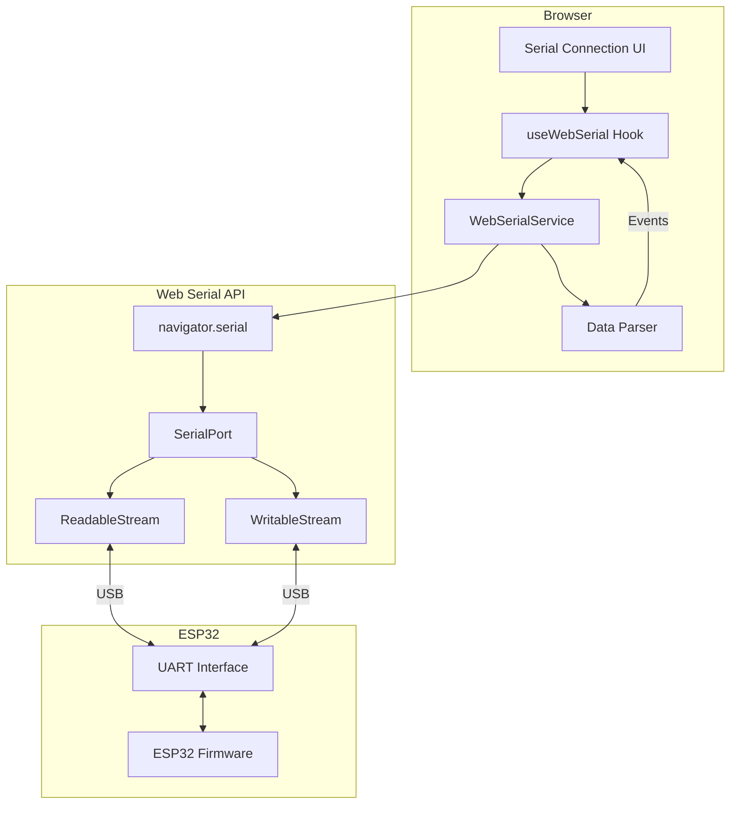

# Design Document: ESP32 Web Serial Communication

## Overview

This design describes a browser-based serial communication system for ESP32 devices using the Web Serial API. The architecture follows a service-oriented pattern with a singleton WebSerialService handling all serial port operations, a React hook for state management, and UI components for user interaction.

## Architecture



## Components and Interfaces

### WebSerialService (Singleton)

The core service managing serial port lifecycle and communication.

```typescript
interface WebSerialService {
  // State
  private port: SerialPort | null;
  private reader: ReadableStreamDefaultReader<string> | null;
  private writer: WritableStreamDefaultWriter<string> | null;
  private isConnected: boolean;
  private readLoopRunning: boolean;
  
  // Public Methods
  isSupported(): boolean;
  getConnectionStatus(): boolean;
  connect(baudRate: number): Promise<boolean>;
  disconnect(): Promise<void>;
  send(data: string): Promise<boolean>;
  sendCommand(command: string, params?: Record<string, any>): Promise<boolean>;
  subscribe(callback: MessageCallback): () => void;
  subscribeToLogs(callback: LogCallback): () => void;
}
```

### useWebSerial Hook

React hook providing reactive state and methods for components.

```typescript
interface UseWebSerialReturn {
  isConnected: boolean;
  isSupported: boolean;
  messages: SerialMessage[];
  variables: Record<string, any>;
  connect: (baudRate?: number) => Promise<boolean>;
  disconnect: () => Promise<void>;
  send: (data: string) => Promise<boolean>;
  sendCommand: (command: string, params?: Record<string, any>) => Promise<boolean>;
  clearMessages: () => void;
}
```

### SerialConnection Component

UI component for connection management.

```typescript
interface SerialConnectionProps {
  // No required props - uses hook internally
}

// Internal state
interface ComponentState {
  isConnecting: boolean;
  baudRate: number;
  dialogOpen: boolean;
  commandInput: string;
}
```

## Data Models

### SerialMessage

```typescript
interface SerialMessage {
  type: 'data' | 'error' | 'connected' | 'disconnected' | 'tx' | 'rx';
  data?: string;
  timestamp: Date;
}
```

### SerialLogEntry

```typescript
interface SerialLogEntry {
  id: string;
  level: 'info' | 'warning' | 'error' | 'debug';
  source: string;
  message: string;
  timestamp: string;
}
```

### SerialOptions (Web Serial API)

```typescript
interface SerialOptions {
  baudRate: number;        // Required: 9600-921600
  dataBits?: number;       // Fixed: 8
  stopBits?: number;       // Fixed: 1
  parity?: 'none';         // Fixed: 'none'
  flowControl?: 'none';    // Fixed: 'none'
}
```

### ParsedVariable

```typescript
interface ParsedVariable {
  name: string;
  value: string | number | boolean;
  raw: string;
}
```

## Correctness Properties

*A property is a characteristic or behavior that should hold true across all valid executions of a system—essentially, a formal statement about what the system should do. Properties serve as the bridge between human-readable specifications and machine-verifiable correctness guarantees.*

### Property 1: Browser Support Detection Consistency

*For any* browser environment, `isSupported()` SHALL return `true` if and only if `navigator.serial` is defined and accessible.

**Validates: Requirements 1.1**

### Property 2: Connection Configuration Integrity

*For any* baud rate value passed to `connect()`, the `port.open()` call SHALL receive an options object containing that exact baud rate along with fixed parameters (dataBits: 8, stopBits: 1, parity: 'none').

**Validates: Requirements 3.2, 3.3, 4.1**

### Property 3: Message Transmission Format

*For any* string passed to `send()`, the data written to the serial port SHALL be the original string concatenated with a newline character (`\n`), and a log entry SHALL be created with the transmission.

**Validates: Requirements 5.2, 5.5**

### Property 4: Line Buffering Correctness

*For any* sequence of incoming data chunks, the system SHALL only emit complete lines (terminated by `\n`) as messages, buffering partial data until a complete line is received.

**Validates: Requirements 6.2, 6.5**

### Property 5: Structured Data Parsing and Event Dispatch

*For any* received line matching the pattern `VARIABLE_NAME:VALUE`, the Data_Parser SHALL:
1. Parse the variable name and value
2. Convert the value to appropriate type (number, boolean, or string)
3. Dispatch a `serial-variable-update` custom event with the parsed data
4. Update the variables state object

**Validates: Requirements 6.3, 6.4, 10.2, 11.1, 11.2**

### Property 6: Value Type Parsing

*For any* value string:
- "true", "1" → boolean `true`
- "false", "0" → boolean `false`
- Valid numeric string → number
- Other strings → string (unchanged)

**Validates: Requirements 10.3, 10.4**

### Property 7: Message History Limit

*For any* sequence of messages, the message history SHALL contain at most 100 entries, keeping only the most recent messages when the limit is exceeded.

**Validates: Requirements 9.5**

### Property 8: Connection Status Visual Mapping

*For any* connection state (connected, disconnected, connecting, error), the UI SHALL display a corresponding distinct visual indicator with appropriate color coding.

**Validates: Requirements 4.5, 9.1**

### Property 9: Log Entry Severity Classification

*For any* log entry created by the system, it SHALL have a valid severity level from the set {info, warning, error, debug}.

**Validates: Requirements 8.4**

### Property 10: Message Type Visual Differentiation

*For any* message displayed in the log, its visual styling (color/class) SHALL correspond to its type: TX (cyan), RX (green), error (red), connected (green), disconnected (yellow).

**Validates: Requirements 9.3, 9.4**

## Error Handling

### Connection Errors

| Error Type | Detection | User Message | Recovery Action |
|------------|-----------|--------------|-----------------|
| Port Busy | "Failed to open serial port" in error message | "Port is busy. Close Arduino IDE Serial Monitor or other programs using the port." | Suggest closing other apps, unplugging cable |
| User Cancelled | `NotFoundError` exception | None (silent) | Return false, no error shown |
| No Ports | Empty port list | "No serial port selected. Make sure your Arduino is connected." | Prompt to check USB connection |
| Timeout | `TimeoutException` | "Connection timed out" | Suggest checking device power |
| Permission Denied | `SecurityError` | "Permission denied. Ensure HTTPS connection." | Redirect to HTTPS |

### Runtime Errors

| Error Type | Detection | Handling |
|------------|-----------|----------|
| Write Failure | Exception in `writer.write()` | Log error, notify user, return false |
| Read Error | Exception in read loop | Log error, attempt graceful disconnect |
| Disconnect Error | Exception in close operations | Log error, continue cleanup, complete disconnect |

### Error Message Format

```typescript
// Structured error logging
log(level: 'error', source: 'serial', message: string): void {
  const entry: SerialLogEntry = {
    id: `serial-${++this.logIdCounter}-${Date.now()}`,
    level,
    source,
    message,
    timestamp: new Date().toISOString(),
  };
  this.logListeners.forEach(cb => cb(entry));
}
```

## Testing Strategy

### Unit Tests

Unit tests verify specific examples and edge cases:

1. **Browser Support Detection**
   - Test with `navigator.serial` present → returns true
   - Test with `navigator.serial` absent → returns false

2. **Connection Flow**
   - Test successful connection sequence
   - Test port busy error handling
   - Test user cancellation handling

3. **Disconnection Cleanup**
   - Test all resources are released
   - Test error resilience during cleanup

4. **UI State Management**
   - Test status indicator states
   - Test message list rendering

### Property-Based Tests

Property tests verify universal properties across generated inputs:

1. **Value Parsing Property** (Property 6)
   - Generate random strings matching boolean/numeric/string patterns
   - Verify `parseValue()` returns correct typed values

2. **Line Buffering Property** (Property 4)
   - Generate random data chunks with varying newline positions
   - Verify only complete lines are emitted

3. **Message History Limit Property** (Property 7)
   - Generate sequences of 50-200 messages
   - Verify history never exceeds 100 entries

4. **Structured Data Parsing Property** (Property 5)
   - Generate random VARIABLE:VALUE strings
   - Verify correct parsing and event dispatch

### Testing Framework

- **Unit Tests**: Vitest with React Testing Library
- **Property Tests**: fast-check library for property-based testing
- **Mocking**: Mock Web Serial API interfaces for isolated testing

### Test Configuration

```typescript
// Property test configuration
fc.assert(
  fc.property(
    fc.string(), // Generated input
    (input) => {
      // Property assertion
    }
  ),
  { numRuns: 100 } // Minimum 100 iterations
);
```
